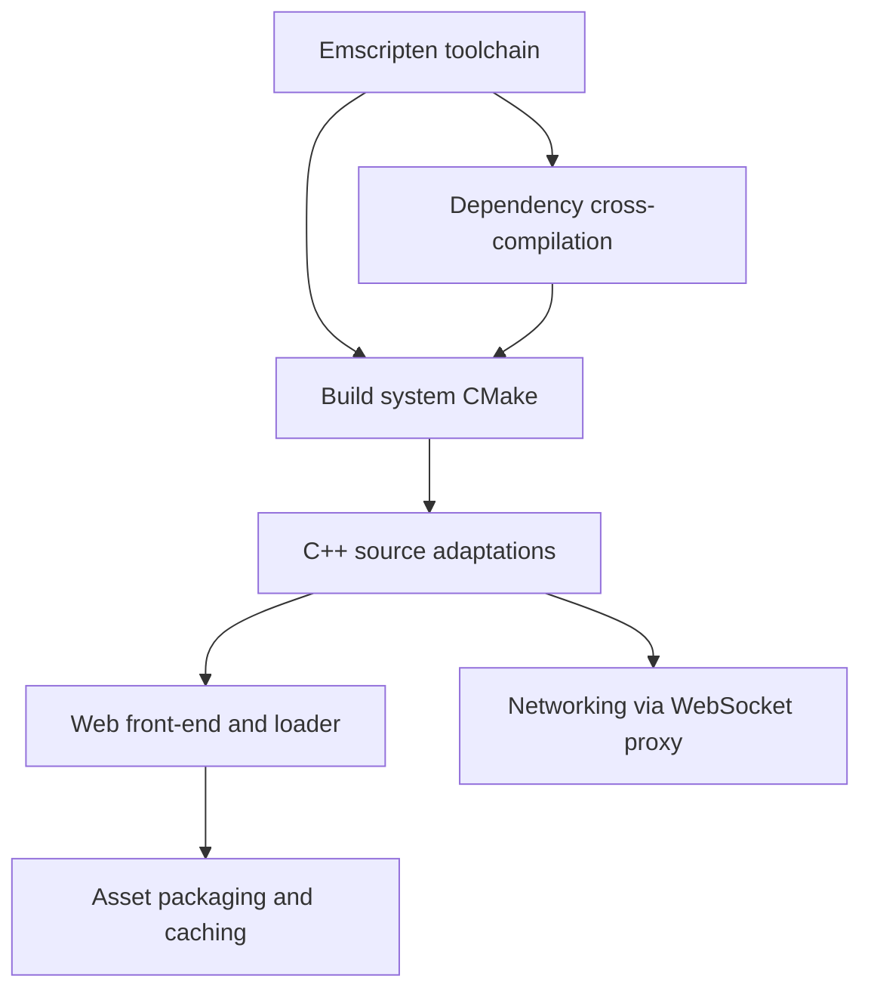

# SuperTuxKart WebAssembly Build – Summary of Changes

This document is a high-level overview of the work done on the `wasm` branch to port
SuperTuxKart to the browser using **Emscripten / WebAssembly**. It is based on the
`wasm`-specific commits, from *"get all dependencies to build with emscripten"* up to
*"allow for a configurable websocket proxy"*.

## Goal

Make the native C++ game compile to WebAssembly and run in a web browser, including
its graphics, audio, persistent user data, asset delivery, and (experimental) online
networking — without a native install.

Current status (per `wasm/README.md`): the game launches with OpenGL ES 2 graphics,
audio, persistent user data, and IndexedDB caching. GLES 3 rendering and full
networking are still work-in-progress; performance is limited because the legacy
renderer is used.

## Overview of the areas changed



## 1. New `wasm/` directory (the port's tooling)

A brand-new top-level `wasm/` folder holds everything specific to the browser build:

- **`get_emsdk.sh`** – clones and installs the Emscripten SDK (`emsdk`).
- **`build_deps.sh`** – cross-compiles all third-party dependencies with Emscripten
  into a local `wasm/prefix/`: `ogg`, `vorbis`, `openssl`, `zlib`, `curl`,
  `libjpeg-turbo`, `libpng`, `freetype`, and `harfbuzz` (freetype is rebuilt with
  harfbuzz support). Built with `-fwasm-exceptions`, `-sSUPPORT_LONGJMP=wasm`,
  `-pthread`.
- **`build.sh`** – configures and builds STK itself via `emcmake`/`emmake`, copies the
  resulting `.js`/`.wasm`/`.data` into `web/game/`, then runs the JS post-processing
  patches.
- **`pack_assets.sh`** – reuses the Android `generate_assets.sh` pipeline to produce
  three texture-quality bundles (low 256 / mid 512 / high 1024), optimizes them,
  `tar` + `gzip -9` compresses each, splits them into **20 MB chunks**, and writes a
  `.manifest` listing size and chunk names.
- **`run_server.py`** – a tiny local HTTP server that sets the **COOP/COEP** headers
  (`Cross-Origin-Opener-Policy` / `Cross-Origin-Embedder-Policy`) required for
  `SharedArrayBuffer` (threads).
- **`patch_js.py` + `fragments/`** – a small patcher that regex-inserts/replaces code
  in Emscripten's generated `supertuxkart.js`:
  - `fix_webgl.js` – works around a WebGL client-side vertex-attribute binding crash.
  - `patch_ws.js` – only allow WebSocket creation when enabled in config.
  - `force_wsproxy.js` – rewrite outgoing TCP socket addresses to go through the
    configured WebSocket proxy URL.
- **`README.md`** – build instructions, working-features list, and TODOs.
- **`.gitignore`** – ignores generated dirs (`build/`, `prefix/`, `emsdk/`,
  `web/game`, `web/config.json`).

## 2. Web front-end (`wasm/web/`)

A minimal single-page launcher for the game:

- **`index.html`** – a canvas plus an info panel describing the experimental port, a
  **texture-quality selector** (low/mid/high), and a *Start Game* button. It wraps
  Emscripten's `run()` so the runtime's readiness can be detected before starting.
- **`script.js`** – the loading/runtime glue:
  - Loads `/config.json`, mounts **IDBFS** at `/home` for persistent user data and
    syncs it back to IndexedDB.
  - Downloads the selected asset bundle in chunks (with a live progress display),
    decompresses it with `pako`, caches it in **IndexedDB** (with a data-version
    check to invalidate old caches), untars it with `js-untar` into the Emscripten
    FS at `/data`.
  - Sets the WebSocket proxy URL on the module when networking is enabled.
- **`config_example.json`** – template config with `ws_enabled` and `ws_proxy`.
- **`_headers`** – COOP/COEP headers for static hosting (e.g. Cloudflare Pages).
- **`404.html`, `favicon.ico`, `supertuxkart_64.png`** – supporting static assets.

## 3. Build system (`CMakeLists.txt`)

A dedicated `if(EMSCRIPTEN)` block was added that:

- Points CMake at the pre-built dependencies in `wasm/prefix/`.
- Forces **GLES2**, disables shaderc, X11, Wayland, Direct3D9, Vulkan and desktop
  OpenGL in Irrlicht (`-D_IRR_COMPILE_WITH_OGLES2_`, `NO_IRR_COMPILE_WITH_*`).
- Uses DNS-C instead of wiiuse, disables RPC.
- Sets Emscripten compile/link flags: `-sUSE_SDL=2`, `-fwasm-exceptions`,
  WebGL2 minimum, `-sFULL_ES2/ES3`, SDL_mixer + OpenAL audio, IDBFS + websocket.js,
  large initial memory (768 MB), `-sWASM_BIGINT`, etc.
- Skips native-only steps (SDL2 `find_library`, `libatomic`) under Emscripten.
- Adds an unrelated `USE_USAN` (undefined-behaviour sanitizer) option and minor
  MSVC/MinGW manifest tweaks that came in alongside the branch.

## 4. C++ source adaptations

Targeted, `#ifdef __EMSCRIPTEN__`-guarded changes so the same codebase still builds
natively:

- **`src/main.cpp`** – the main loop is driven by `emscripten_set_main_loop` /
  `emscripten_cancel_main_loop` (the browser owns the frame loop) instead of the
  native blocking loop; some desktop-only startup paths are skipped.
- **`src/main_loop.cpp`** – adjustments for the browser-driven, single-iteration loop.
- **Input** (`sdl_controller.cpp`, `input_manager.*`) – re-enable/adjust controller
  handling under SDL2 in the browser.
- **Audio** (`sfx_manager.cpp`) – get OpenAL/SDL_mixer audio working in wasm.
- **Graphics** – numerous small fixes across the SP renderer, Irrlicht
  `CIrrDeviceSDL`/`COGLES2Driver`, and the `graphics_engine` (GE) sources to cope
  with GLES2-only rendering and scaling; legacy graphics are forced on for now.
- **`src/io/file_manager.cpp`, `src/config/user_config.cpp`** – persistent-config /
  filesystem handling for the IDBFS-backed home directory.
- **`CGUIEditBox.cpp`** and screen fixes (`tracks_and_gp_screen.cpp`, etc.) – GUI
  stability fixes surfaced by the port.

## 5. Networking (WebSocket proxy)

Because browsers cannot open raw TCP sockets, the final commits route STK's TCP
traffic (login, add-on downloads) through a **WebSocket proxy**:

- The proxy URL is configurable at runtime via `config.json` (`ws_enabled`,
  `ws_proxy`) and applied in `script.js`.
- The `force_wsproxy.js` / `patch_ws.js` fragments rewrite Emscripten's socket layer
  to send each connection's target `host:port` to the proxy and to refuse WebSocket
  creation when networking is disabled.

## 6. Telemetry (log forwarding)

Browser and engine log output is forwarded to Cloudflare so sessions (including
Discord Activities) can be inspected after the fact. It is always on and
fail-open — telemetry errors never affect game start-up.

- **`wasm/web/telemetry.js`** – a dependency-injected collector that wraps
  Emscripten's `Module.print`/`printErr`, the JS `console.*` methods and uncaught
  errors (still printing to the real console), buffers `{ts, level, source,
  message}` entries and flushes them (every ~5 s and on `pagehide`/
  `visibilitychange`) via `navigator.sendBeacon`, falling back to
  `fetch(..., {keepalive: true})`. Wired up in `wasm/web/script.js`.
- **`wasm/worker/telemetry.mjs`** – the same-origin `POST /api/telemetry` route
  that validates/clamps each batch and fans it out to two Cloudflare-native
  sinks: the **Analytics Engine** dataset `stk_wasm_telemetry` (binding
  `TELEMETRY`) for queryable ~90-day history, and **Workers Logs** (`console.*`)
  for live `wrangler tail`.
- **`wasm/wrangler.jsonc`** – adds the `TELEMETRY` Analytics Engine dataset and
  enables `observability` so the echoed lines persist.

See the *Telemetry* section of `wasm/README.md` for the row schema, an example
Analytics Engine SQL query, and `wrangler tail` usage.

## How to build (quick reference)

```bash
wasm/get_emsdk.sh                 # 1. get Emscripten SDK
wasm/build_deps.sh                # 2. cross-compile dependencies
wasm/build.sh                     # 3. build STK to wasm + patch JS
wasm/pack_assets.sh ../stk-assets # 4. package/compress/split assets
(cd wasm/web && python3 ../run_server.py)   # 5. serve locally
```

## Notes

- This branch corresponds to the upstream SuperTuxKart pull request
  [#5106](https://github.com/supertuxkart/stk-code/pull/5106) and was authored by
  *ading2210*.
- The port is explicitly experimental: GLES3 rendering, lazy asset loading, and full
  networking remain open TODOs, and some online-multiplayer options may hang the game.
